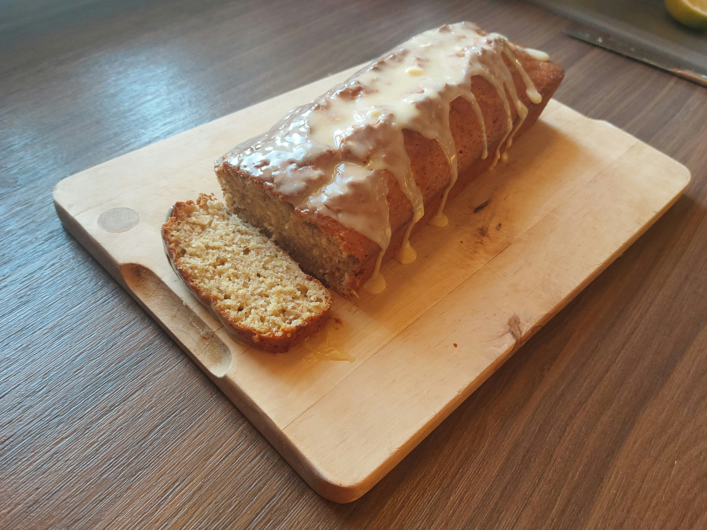

# Einfaches Bananenbrot

## Zutaten

**Für 1 Brot (ca. 10 Stücke):**

- 3 reife Bananen
- 80 ml neutrales Öl (z. B. Sonnenblumenöl)
- 110 g brauner Zucker
- 2 Eier (Größe M)
- 200 g Weizenmehl (Type 405, glatt)
- 3 TL Backpulver
- 1 Prise Salz
- 1 Packerl Vanillezucker
- 1 Prise Zimt
- Etwas Butter für die Form

---

## Zubereitung

**Zubereitungszeit:** ca. 20 Min. | **Backzeit:** ca. 55 Min. | **Gesamtzeit:** ca. 1 Std. 15 Min.

1.  **Vorbereitung:**
    Den Backofen auf **180 °C Ober-/Unterhitze** (Umluft: 160 °C) vorheizen. Eine Kastenform (Innenmaße 23 x 10 cm) gut einfetten.
    Die Bananen schälen und in einer Schüssel mit einer Gabel zu einem Brei zerdrücken.

2.  **Teig anrühren:**
    In einer Rührschüssel das Öl mit dem braunen Zucker und dem Vanillezucker verquirlen.
    Mehl, Backpulver, Salz und Zimt vermischen und unter die Öl-Zucker-Masse rühren.

3.  **Bananen hinzufügen:**
    Zum Schluss das Bananen-Püree unter den Teig heben und gut einrühren.

4.  **Backen:**
    Den Teig in die vorbereitete Kastenform füllen und im vorgeheizten Ofen auf mittlerer Schiene bis das Brot gebräunt ist ca. **50 Minuten** backen.

5.  **Abkühlen:**
    Das Bananenbrot nach dem Backen zunächst in der Form genug kühlen lassen, um es vorsichtig herausnehmen zu können.

---

## Tipps zum Rezept

- **Kuvertüre:** Wie am Bild zu sehen, passt eine weiße Kuvertüre super zum Brot.
- **Variationen:** Auch Schokostückchen oder Blaubeeren passen hervorragend in den Teig.

---

**Nährwerte (pro Portion):**

- Energie: 232 kcal / 971 kJ
- Kohlenhydrate: 33 g
- Eiweiß: 4 g
- Fett: 9 g

_Quelle: [Einfachbacken.de](https://www.einfachbacken.de/rezepte/bananenbrot)_
