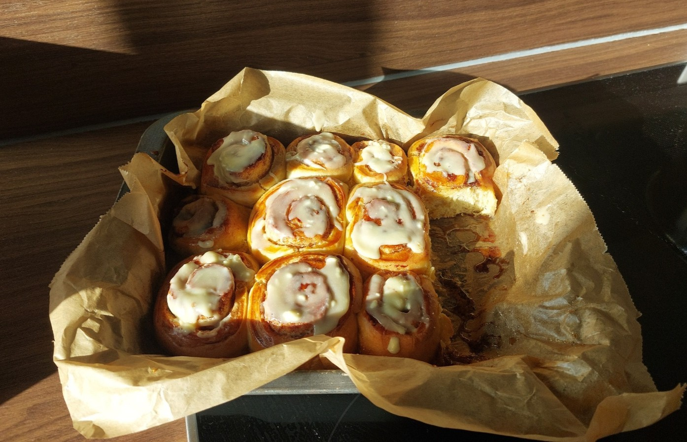

# Zimtschnecken einfach & klassisch

## Zutaten

**Für den Teig (ergibt ca. 12 Stück):**

- 500 g Mehl (glatt)
- 90 g Butter
- 50 g Zucker
- 250 ml Milch
- 21 g Frischhefe (oder 1 Päckchen/7 g Trockenhefe)
- 1 Päckchen Bourbon-Vanillezucker
- 1 Prise Salz

**Für die Zimt-Zucker-Butter Füllung:**

- 100 g weiche Butter
- 100 g brauner Zucker
- 2 TL Zimt

**Zum Bestreichen:**

- 1 Eigelb
- 1 EL Wasser

---

## Zubereitung

**Ruhezeit Teig:** 30–60 Min. | **Ruhezeit Blech:** 30 Min. | **Backzeit:** 15–20 Min.

1. **Vorbereitung:**
   Den Backofen rechtzeitig auf **180 °C Ober-/Unterhitze** vorheizen.

2. **Hefemilch zubereiten:**
   90 g Butter auf dem Herd oder in der Mikrowelle bei geringer Hitze schmelzen.
   250 ml kalte Milch eingießen (die Mischung ist dann lauwarm) und darin die Hefe auflösen.

3. **Teig kneten:**
   500 g Mehl mit 1 Prise Salz, Vanillezucker und 50 g Zucker vermengen.
   Das Butter-Hefe-Gemisch hinzufügen und 3–5 Minuten zu einem glatten Teig kneten.

4. **Gehen lassen:**
   Den Teig zu einer Kugel formen, abdecken und bei Raumtemperatur **30–60 Minuten** ruhen lassen, bis sich das Volumen verdoppelt hat.

5. **Füllen & Formen:**
   - Füllung mischen: 100 g weiche Butter, 100 g braunen Zucker und 2 TL Zimt verrühren.
   - Den Teig auf einer bemehlten Arbeitsfläche zu einem Rechteck (ca. 40 × 35 cm, 0,5 cm dick) ausrollen.
   - Gleichmäßig mit der Füllung bestreichen, dabei ca. 1 cm Rand lassen.
   - Von der langen Seite eng aufrollen und in **ca. 3 cm dicke Scheiben** schneiden.

6. **Zweite Ruhezeit:**
   Die Schnecken auf ein Blech legen, abdecken und nochmals **30 Minuten** ruhen lassen.

7. **Backen:**
   Eigelb mit Wasser verquirlen und die Schnecken bestreichen.
   Im vorgeheizten Ofen **15–20 Minuten** backen.

8. **Servieren:**
   Optional nach dem Abkühlen mit Zuckerguss (Puderzucker + Wasser) verzieren.

---

## Tipps zum Rezept

- **Glasur:** Mit einer weißen Kuvertüre sind die Zimtschnecken noch zehnmal besser
- **Eier:** Achtung beim Bestreichen mit dem Eigelb - zu viel an einer Stelle, und Rührei entsteht nach dem Backen ;)
- **Hefe:** Achte darauf, dass die Hefe frisch ist – abgelaufene Hefe geht schlechter.
- **Füllung:** Butter rechtzeitig aus dem Kühlschrank nehmen, damit sie weich ist.

_Quelle: Emmi_
